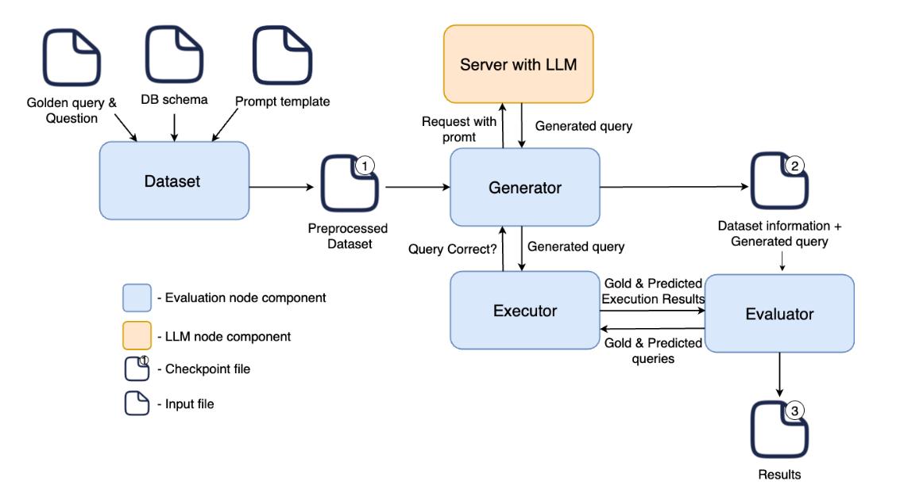
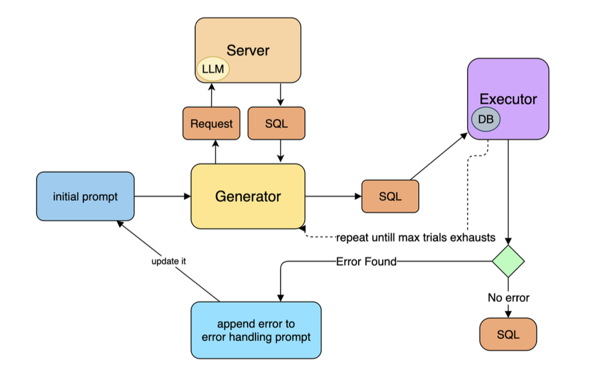

# Text-to-SQL Model Evaluation

An evaluation harness for text-to-SQL models: run a benchmark against a model,
execute the generated SQL against the real database, and score it on whether
the results match.

It compares models across four benchmarks and five serving backends through one
command, so the same evaluation can be pointed at a hosted API, a self-hosted
inference server, or a model loaded locally.

## Benchmarks

| Benchmark | Split | Questions |
|-----------|-------|----------:|
| WikiSQL | test | 15,878 |
| BIRD | validation | 1,534 |
| Spider | validation | 1,034 |
| Defog | questions_gen | 210 |

Use `--num-rows` to evaluate a sample rather than the full split.

## Results

This suite was built for a bachelor thesis at Vrije Universiteit Amsterdam,
*Benchmarking Small LLMs for SQL Generation*,
which asked which small open-weight models are good enough to replace a
proprietary API when the data can't leave the building. Models that run on
customer hardware in an air-gapped environment avoid sending sensitive
database content to a third party, so the practical question is how much
accuracy that costs.

Four models, four benchmarks, 4,278 questions:

| Model | Params | Execution accuracy | Execution error rate | Error correction rate |
|-------|-------:|-------------------:|---------------------:|----------------------:|
| GPT-4o mini *(proprietary, reference)* | — | **61.71%** | **1.17%** | **79.22%** |
| Natural-SQL-7B | 6.9B | 46.61% | 13.91% | 66.56% |
| Prem-1B-SQL | 1.3B | 42.64% | 10.33% | 43.75% |
| SQLCoder-2-7b | 6.7B | 31.51% | 40.91% | 1.34% |

**Execution accuracy** is the share of generated queries whose results match
the gold query's. **Execution error rate** is the share that fail to run at
all. **Error correction rate** is the share of first-attempt failures that
execution-guided decoding recovered — the retry loop above, measured.

### Per dataset

Execution accuracy — correct / total:

| Model | Defog | Spider | BIRD | WikiSQL |
|-------|------:|-------:|-----:|--------:|
| GPT-4o mini | **82.86%** (174/210) | 74.85% (774/1034) | **30.25%** (464/1534) | **81.87%** (1228/1500) |
| Natural-SQL-7B | 53.81% (113/210) | 68.09% (704/1034) | 23.86% (366/1534) | 54.07% (811/1500) |
| Prem-1B-SQL | 41.43% (87/210) | **75.05%** (776/1034) | 26.40% (405/1534) | 37.07% (556/1500) |
| SQLCoder-2-7b | 55.24% (116/210) | 50.19% (519/1034) | 11.93% (183/1534) | 35.33% (530/1500) |

The proprietary reference wins overall, but not on every dataset, and the gap
is narrower than the parameter difference suggests. Prem-1B-SQL edges out
GPT-4o mini on Spider — 776 correct against 774 — at 1.3B parameters. Among
the open-weight models Natural-SQL-7B is strongest overall, and BIRD is where
all four struggle most, none clearing 31%.

SQLCoder-2-7b shows why accuracy alone is misleading. On Defog it scores
55.24%, ahead of Natural-SQL-7B's 53.81%, which looks competitive. But across
all four benchmarks 40.91% of its queries fail to execute and it recovers from
1.34% of those failures — so its output is far less usable than its accuracy
suggests. That is the argument for measuring all three metrics.

## How it works



A dataset is assembled from three inputs — the gold query and question, the
database schema, and a prompt template — into a preprocessed dataset **①**. The
generator sends each prompt to a model and collects the query it returns,
writing dataset rows plus generated queries to **②** (`predict.json`). The
executor then runs both the gold and the predicted query against the real
database, the evaluator compares their result sets, and the scores land in
**③** (`accuracy.json` and `predict_eval.json`).

Checkpoint ② is why a rerun of the same dataset/backend/model makes no model
calls: if that file exists it's reused verbatim. Pass `--force` to regenerate.

### Execution-guided decoding



When an executor is supplied, generation isn't a single shot. A query that
fails to execute is fed back into the prompt along with its error message, and
the model tries again, up to `--max-retries` attempts. Only a query that
executes cleanly — or the last attempt — is kept.

This is what produces the correction statistics at the end of a run ("first try
failed / managed to correct"), and `--no-execution-guided` turns it off.

## What this is built on

This harness is built on [premsql](https://github.com/premAI-io/premsql) by
PremAI, which provides the core dataset/generator/executor/evaluator
abstractions. The library is used through a fork that adds the capabilities
this project needed — see [Extensions to premsql](#extensions-to-premsql).

premsql is MIT-licensed. Its repository states this in the README but ships no
`LICENSE` file, so the fork adds one carrying MIT forward with attribution to
both PremAI and this project.

## Supported matrix

| Dataset | Split | Auto-downloads | Notes |
|---------|-------|----------------|-------|
| `bird` | validation | yes (~1.4GB) | Scored by `difficulty` (simple/moderate/challenging) |
| `spider` | validation | yes | Scored by `db_id` |
| `defog` | questions_gen | no | Per-`db_id` JSON schemas; can run against Postgres |
| `wikisql` | test | no | One combined SQLite file, JSON column metadata |

| Backend | Endpoint | Use for |
|---------|----------|---------|
| `openrouter` | OpenRouter API | Hosted models (GPT, Claude, Llama, DeepSeek, Qwen) |
| `hf` | `http://0.0.0.0:7860/v1` | Self-hosted inference server (vLLM, TGI) |
| `lmstudio` | `http://localhost:1234/v1` | LM Studio, typically quantized models |
| `runpod` | `http://127.0.0.1:8000/v1` | Model served on a RunPod GPU pod |
| `local` | in-process | Loaded directly with transformers, no server |

Any server exposing an OpenAI-compatible `/v1/completions` endpoint works with
the `hf`, `lmstudio` and `runpod` backends — they differ only in default URL.
[hf_model_server](https://github.com/knikolaevskii/hf_model_server) is a
companion project for this: a CUDA-optimised Hugging Face model server with
OpenAI-compatible endpoints and dynamic model switching, for running models on
a VPS or GPU box. It defaults to port 7860, which is why `--backend hf` does
too.

```bash
python hf_server.py --model premai-io/prem-1B-SQL --port 7860

python source/code/run_eval.py --dataset bird --backend hf \
    --model premai-io/prem-1B-SQL --num-rows 100
```

`wikisql` and `defog` have no downloader — they aren't distributed in a
runnable form. WikiSQL ships no SQL at all (only a structured
`{sel, agg, conds}` form that has to be rendered into queries), and Defog ships
Postgres dumps that must be loaded into a server. `prepare_datasets.py` handles
both:

```bash
# clones the benchmark, unpacks it, converts 13,640 questions
python source/code/prepare_datasets.py wikisql --auto

# clones both repos, converts 210 questions, loads the 11 Postgres databases
python source/code/prepare_datasets.py defog --auto --load-db
```

Sources are cloned once into `.dataset_sources/` (gitignored) and reused, so
re-converting doesn't re-download. Drop `--auto` to point at existing clones,
and `--load-db` to skip touching Postgres.

`--load-db` **drops and recreates** those 11 databases, and needs a running
server. It detects the right role automatically — on Homebrew/initdb installs
that's your own username rather than `postgres`, which `defog-data/setup.sh`
alone doesn't handle. Put matching values in `.env` as `POSTGRES_*`, then:

```bash
python source/code/run_eval.py --dataset defog --backend openrouter \
    --model gpt-4o-mini --executor postgres --filter-by query_category
```

The database for each question is taken from its `db_id`, so one run covers
all 11; `--db-name` forces every row at a single database instead.

Running an unprepared dataset exits with the exact command that produces it
rather than a stack trace.

## Metrics

**Execution Accuracy** — the generated SQL is executed against the real
database and compared to the gold query's results. A query that looks nothing
like the reference still counts as correct if it returns the same rows, which
is the point: there are many valid ways to express one question.

**Valid Efficiency Score (VES)** (`--metric ves`) — accuracy weighted by how
the generated query's runtime compares to the reference.

**Subset matching** — partial credit when the gold result set is *contained* in
the prediction, e.g. the model selected the right answer plus extra columns.
Scored separately from an outright miss.

Results break down into four buckets, which matter more than the headline
number: `exact`, `subset`, `logic_err` (ran, wrong rows) and `db_err` (failed
to execute). A model failing mostly on `db_err` has a syntax problem; one
failing on `logic_err` misunderstands the schema.

## Quickstart

```bash
python3 -m venv .venv
.venv/bin/python -m pip install -r requirements.txt

cp .env.example .env      # add OPENROUTER_API_KEY for hosted models
```

Verify the setup — checks the library resolves, reports which keys are set
(without printing them), downloads the Bird validation split, and runs a gold
query against the real database:

```bash
.venv/bin/python source/code/check_setup.py
```

Then run an evaluation — either against a hosted model, or entirely locally
with no API key:

```bash
# hosted, needs OPENROUTER_API_KEY
.venv/bin/python source/code/run_eval.py \
    --dataset bird --backend openrouter --model gpt-4o-mini --num-rows 10

# local, no key and no server — downloads the model on first run
.venv/bin/python source/code/run_eval.py \
    --dataset bird --backend local --model premai-io/prem-1B-SQL --num-rows 10
```

See [`examples/`](examples/) for worked walkthroughs of the OpenRouter and
self-hosted-server backends, including the full flag reference.

## Extensions to premsql

The fork this depends on adds:

- **Subset-match scoring** — `BaseExecutor.match_sqls` reports whether the gold
  result set is contained in the prediction, alongside exact match, so partial
  answers are distinguishable from wrong ones.
- **Bracket-expansion gold queries** — a gold query written as
  `SELECT {a, b} FROM t` expands to every column-subset permutation, letting one
  reference query accept several valid answers.
- **WikiSQL and Defog datasets** — via a pluggable schema source. Upstream
  always introspects a SQLite file to build the schema prompt; these datasets
  ship JSON column metadata instead (one combined file for WikiSQL, one per
  `db_id` for Defog), so `Text2SQLBaseInstance` now takes a `schema_source`.
- **`PostgresExecutor`** — for Defog benchmarks that run against Postgres,
  reading credentials from the environment.
- **OpenRouter, generic-API, and WikiSQL generators** — for OpenAI-compatible
  endpoints that aren't OpenAI.
- **Error-correction tracking** — execution-guided decoding now reports how
  often a first attempt failed and how often re-prompting with the error
  recovered it.

It also carries fixes needed to make the library usable here: a too-tight
`huggingface-hub` pin that made premsql uninstallable alongside current
transformers, a Bird download that fetched the training databases (100GB+) even
when only the validation split was requested, and a result-comparison bug that
counted any two result sets with matching column *names* as equal regardless of
their values.

## Layout

```
source/code/run_eval.py       the evaluation runner
source/code/check_setup.py    environment/install verification
source/prompts/               per-benchmark prompt templates
examples/                     worked examples per backend
```

## Notes

Results are cached per experiment name under
`~/Library/Caches/premsql/experiments/`. A rerun of the same
dataset/backend/model reuses that cache and makes **no model call** — pass
`--force` to regenerate.

Hosted providers are not deterministic even at `temperature=0`, so scores vary
between runs. Use a few hundred rows before comparing models seriously.
